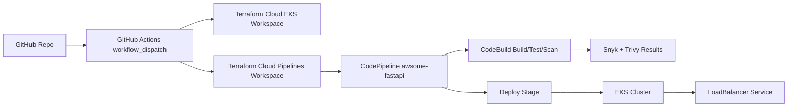

# Cloud Native DevSecOps Pipeline on AWS

Portfolio project: end-to-end secure CI/CD on AWS using Terraform Cloud, GitHub Actions, CodePipeline, CodeBuild, Snyk, Trivy, and EKS.

## Project Summary

This project automates:

1. Source from GitHub.
2. Infrastructure provisioning with Terraform Cloud.
3. Build, test, and security scans in CodeBuild.
4. Image and deployment flow through CodePipeline.
5. Runtime deployment to Amazon EKS behind a LoadBalancer.

## What I Accomplished

1. Provisioned EKS cluster and managed node group in us-east-1.
2. Integrated Terraform Cloud workspaces with AWS OIDC role-based auth.
3. Deployed AWS pipeline resources (CodePipeline, CodeBuild, S3, connection resources).
4. Completed pending GitHub connection activation in AWS Console.
5. Triggered successful pipeline execution and deployed awsome-fastapi to EKS.
6. Verified deployment health with kubectl:
  - 2/2 pods running
  - LoadBalancer service provisioned
7. Improved static-analysis build behavior for demo use:
  - Snyk findings remain visible
  - report artifacts exported (JSON + SARIF)
  - severity summary printed in logs
  - scan step configured non-blocking for tutorial deployment flow

## Architecture



## Prerequisites

1. AWS account with IAM permissions for IAM, EKS, CodePipeline, CodeBuild, S3, ELB.
2. GitHub account.
3. Terraform Cloud account.
4. Snyk account (token + org id).
5. Local tools:
  - Terraform CLI
  - Git
  - aws CLI
  - kubectl

## Repositories

1. Pipeline repo: https://github.com/devsecblueprint/aws-devsecops-pipeline
2. App repo: https://github.com/devsecblueprint/awsome-fastapi

## Step-by-Step Walkthrough

### Phase 1: Snyk Setup

1. Create Snyk account.
2. Capture:
  - SNYK_TOKEN
  - SNYK_ORG_ID

### Phase 2: Terraform Cloud Setup

1. Create Terraform Cloud organization.
2. Create project.
3. Create CLI-driven workspaces:
  - dsb-aws-devsecops-eks-cluster
  - dsb-aws-devsecops-pipelines
4. Create Terraform Cloud user token for GitHub secret.

### Phase 3: AWS OIDC for Terraform Cloud

1. IAM Identity Provider:
  - URL: https://app.terraform.io
  - Audience: aws.workload.identity
2. IAM role for Terraform Cloud runs.
3. Trust policy `sub` must match your real Terraform org.

### Phase 4: Terraform Cloud Variable Set

Add environment variables (apply to both workspaces):

1. TFC_AWS_PROVIDER_AUTH=true
2. TFC_AWS_RUN_ROLE_ARN=<your role arn>

### Phase 5: GitHub Secret

In pipeline repo secrets:

1. TF_API_TOKEN=<terraform cloud api token>

### Phase 6: Terraform Cloud Workspace Secrets

In workspace dsb-aws-devsecops-pipelines:

1. SNYK_TOKEN (sensitive)
2. SNYK_ORG_ID (sensitive)

### Phase 7: Provision Infrastructure

1. Run `.github/workflows/main.yml` manually from GitHub Actions.
2. Confirm both jobs succeed:
  - terraform-apply-eks
  - terraform-apply-pipelines

### Phase 8: Activate Connection

1. AWS Console -> CodePipeline -> Settings -> Connections
2. Open pending GitHub connection.
3. Update pending connection and authorize GitHub app.
4. Confirm status is Available.

### Phase 9: Deploy the App

1. Open CodePipeline `awsome-fastapi`.
2. Click Release change.
3. Monitor stages to success.

### Phase 10: Verify Runtime

```bash
aws eks update-kubeconfig --name dsb-devsecops-cluster --region us-east-1 --profile <your-profile>
kubectl get deploy,svc,pods -A | grep -E 'awsome-fastapi|NAMESPACE'
```

Expected:

1. deployment.apps/awsome-fastapi available
2. service/awsome-fastapi type LoadBalancer with external DNS
3. pods running

## Security Scanning Notes

1. Snyk reports are exported as build artifacts:
  - reports/snyk-deps.json
  - reports/snyk-deps.sarif
  - reports/snyk-code.json
  - reports/snyk-code.sarif
2. Build logs print summarized High/Critical counts.
3. Demo mode keeps scan visibility but does not block deploy on findings.

## Cost Guidance

EKS + worker nodes + LoadBalancer are the main cost drivers.

Low-cost strategy:

1. Run demo, capture proof, destroy the same day.
2. Avoid leaving EKS running overnight.

## Cleanup

Use this order:

```bash
terraform -chdir=terraform/pipelines destroy -var 'aws_profile=<your-profile>' -auto-approve
terraform -chdir=terraform/eks-cluster destroy -var 'aws_profile=<your-profile>' -auto-approve
```

Then verify in AWS:

1. No EKS clusters.
2. No CodePipeline pipelines.
3. No pending/active unused connections.
4. No orphan ELB/EBS resources.

## Video Tutorial Script

Use this as your narration script.

### Intro (0:00-0:30)

"In this project, I built a cloud-native DevSecOps pipeline on AWS. I use Terraform Cloud for infrastructure automation, GitHub Actions for orchestration, CodePipeline and CodeBuild for CI/CD, and Snyk and Trivy for security scanning, then deploy the app to EKS."

### Architecture (0:30-1:00)

"My GitHub workflow triggers Terraform Cloud runs for two workspaces: one for EKS and one for pipeline resources. The deployment pipeline then builds, scans, and deploys the application to Kubernetes."

### Terraform Cloud + OIDC (1:00-1:40)

"I configured AWS OIDC trust with Terraform Cloud so runs can assume an IAM role securely, without static long-lived cloud keys in CI."

### Infra Provisioning (1:40-2:20)

"Here is the GitHub Actions run. Both Terraform apply jobs succeeded: EKS infrastructure and pipeline infrastructure."

### Connection Activation (2:20-2:45)

"After provisioning, I manually activated the pending GitHub connection in CodePipeline settings by authorizing the AWS GitHub app."

### Pipeline Execution (2:45-3:30)

"I triggered the awsome-fastapi pipeline release. It ran source, build, tests, security scans, and deploy stages successfully."

### Security Results (3:30-4:15)

"Snyk and Trivy outputs are available in CodeBuild logs and artifacts. I also added JSON and SARIF exports plus summary counts for High and Critical findings."

### Runtime Verification (4:15-5:00)

"Using kubectl, I verified the deployment, service, and running pods. The service is exposed via a LoadBalancer endpoint, confirming successful deployment to EKS."

### Cost & Cleanup (5:00-5:30)

"Because EKS can be expensive for demos, I tear everything down after validation using Terraform destroy for pipelines first, then EKS."

### Close (5:30-5:45)

"This demonstrates practical DevSecOps skills across infrastructure as code, cloud security scanning, CI/CD automation, Kubernetes deployment, and cost-aware operations."

## Portfolio Checklist

1. Screenshot of Terraform Cloud successful runs.
2. Screenshot of CodePipeline success.
3. Screenshot of scan logs/artifacts.
4. Screenshot of kubectl output with running pods and service.
5. Screenshot of app endpoint response.
6. Screenshot of successful cleanup/no residual resources.
