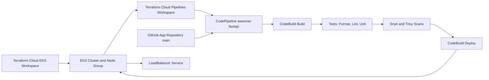
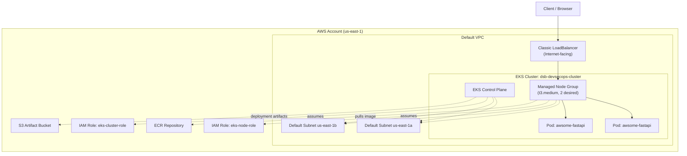

# Cloud Native DevSecOps Pipeline on AWS

Portfolio project: end-to-end secure CI/CD on AWS using Terraform Cloud, GitHub Actions, CodePipeline, CodeBuild, Snyk, Trivy, and EKS.

## Project Summary

This project automates:

1. Source from GitHub.
2. Infrastructure provisioning with Terraform Cloud.
3. Build, test, and security scans in CodeBuild.
4. Image and deployment flow through CodePipeline.
5. Runtime deployment to Amazon EKS behind a LoadBalancer.

## What I Accomplished

1. Provisioned EKS cluster and managed node group in us-east-1.
2. Integrated Terraform Cloud workspaces with AWS OIDC role-based auth.
3. Deployed AWS pipeline resources (CodePipeline, CodeBuild, S3, connection resources).
4. Completed pending GitHub connection activation in AWS Console.
5. Triggered successful pipeline execution and deployed awsome-fastapi to EKS.
6. Verified deployment health with kubectl:
  - 2/2 pods running
  - LoadBalancer service provisioned
7. Improved static-analysis build behavior for demo use:
  - Snyk findings remain visible
  - report artifacts exported (JSON + SARIF)
  - severity summary printed in logs
  - scan step configured non-blocking for tutorial deployment flow

## Architecture


```mermaid
flowchart LR
  A[Terraform Cloud EKS Workspace] --> B[EKS Cluster and Node Group]
  B --> C[Terraform Cloud Pipelines Workspace]
  C --> D[CodePipeline awsome-fastapi]
  E[GitHub App Repository main] --> D
  D --> F[CodeBuild Build]
  F --> G[Tests: Format, Lint, Unit]
  G --> H[Snyk and Trivy Scans]
  H --> I[CodeBuild Deploy]
  I --> B
  B --> J[LoadBalancer Service]
```

## AWS Infrastructure Diagram


```mermaid
flowchart TB
  subgraph AWS["AWS Account (us-east-1)"]
    subgraph VPC["Default VPC"]
      SubnetA["Default Subnet us-east-1a"]
      SubnetB["Default Subnet us-east-1b"]

      subgraph EKS["EKS Cluster: dsb-devsecops-cluster"]
        CP["EKS Control Plane"]
        NG["Managed Node Group\n(t3.medium, 2 desired)"]
        Pod1["Pod: awsome-fastapi"]
        Pod2["Pod: awsome-fastapi"]
      end

      CLB["Classic LoadBalancer\n(Internet-facing)"]
    end

    ECR["ECR Repository"]
    S3["S3 Artifact Bucket"]
    ClusterRole["IAM Role: eks-cluster-role"]
    NodeRole["IAM Role: eks-node-role"]
  end

  Internet["Client / Browser"] --> CLB
  CLB --> NG
  NG --> Pod1
  NG --> Pod2
  NG -.-> SubnetA
  NG -.-> SubnetB
  CP -.-> SubnetA
  CP -.-> SubnetB
  CP -. assumes .-> ClusterRole
  NG -. assumes .-> NodeRole
  NG -. pulls image .-> ECR
  CP -. deployment artifacts .-> S3
```

## Prerequisites

1. AWS account with IAM permissions for IAM, EKS, CodePipeline, CodeBuild, S3, ELB.
2. GitHub account.
3. Terraform Cloud account.
4. Snyk account (token + org id).
5. Local tools:
  - Terraform CLI
  - Git
  - aws CLI
  - kubectl

## Repositories

1. Pipeline repo: https://github.com/devsecblueprint/aws-devsecops-pipeline
2. App repo: https://github.com/devsecblueprint/awsome-fastapi

## Step-by-Step Walkthrough

### Phase 1: Snyk Setup

1. Create Snyk account.
2. Capture:
  - SNYK_TOKEN
  - SNYK_ORG_ID

### Phase 2: Terraform Cloud Setup

1. Create Terraform Cloud organization.
2. Create project.
3. Create CLI-driven workspaces:
  - dsb-aws-devsecops-eks-cluster
  - dsb-aws-devsecops-pipelines
4. Create Terraform Cloud user token for GitHub secret.

### Phase 3: AWS OIDC for Terraform Cloud

1. IAM Identity Provider:
  - URL: https://app.terraform.io
  - Audience: aws.workload.identity
2. IAM role for Terraform Cloud runs.
3. Trust policy `sub` must match your real Terraform org.

### Phase 4: Terraform Cloud Variable Set

Add environment variables (apply to both workspaces):

1. TFC_AWS_PROVIDER_AUTH=true
2. TFC_AWS_RUN_ROLE_ARN=<your role arn>

### Phase 5: GitHub Secret

In pipeline repo secrets:

1. TF_API_TOKEN=<terraform cloud api token>

### Phase 6: Terraform Cloud Workspace Secrets

In workspace dsb-aws-devsecops-pipelines:

1. SNYK_TOKEN (sensitive)
2. SNYK_ORG_ID (sensitive)

### Phase 7: Provision Infrastructure

1. Run `.github/workflows/main.yml` manually from GitHub Actions.
2. Confirm both jobs succeed:
  - terraform-apply-eks
  - terraform-apply-pipelines

### Phase 8: Activate Connection

1. AWS Console -> CodePipeline -> Settings -> Connections
2. Open pending GitHub connection.
3. Update pending connection and authorize GitHub app.
4. Confirm status is Available.

### Phase 9: Deploy the App

1. Open CodePipeline `awsome-fastapi`.
2. Click Release change.
3. Monitor stages to success.

### Phase 10: Verify Runtime

```bash
aws eks update-kubeconfig --name dsb-devsecops-cluster --region us-east-1 --profile <your-profile>
kubectl get deploy,svc,pods -A | grep -E 'awsome-fastapi|NAMESPACE'
```

Expected:

1. deployment.apps/awsome-fastapi available
2. service/awsome-fastapi type LoadBalancer with external DNS
3. pods running

## Security Scanning Notes

1. Snyk reports are exported as build artifacts:
  - reports/snyk-deps.json
  - reports/snyk-deps.sarif
  - reports/snyk-code.json
  - reports/snyk-code.sarif
2. Build logs print summarized High/Critical counts.
3. Demo mode keeps scan visibility but does not block deploy on findings.

## Cost Guidance

EKS + worker nodes + LoadBalancer are the main cost drivers.

Low-cost strategy:

1. Run demo, capture proof, destroy the same day.
2. Avoid leaving EKS running overnight.

## Cleanup

Destroy infrastructure in dependency order. In Terraform Cloud, open each workspace and select **Settings** -> **Destruction and deletion** -> **Queue destroy plan**. Review the destroy plan, then confirm the apply.

1. Destroy the `dsb-aws-devsecops-pipelines` workspace first. This removes the CodePipeline, CodeBuild projects, ECR repository, artifact bucket, pipeline IAM resources, and EKS access configuration.
2. While the EKS cluster still exists, delete the application resources. The Kubernetes Deployment and LoadBalancer Service are created by CodeBuild, not owned by the EKS Terraform workspace.

```bash
aws eks update-kubeconfig \
  --name dsb-devsecops-cluster \
  --region us-east-1 \
  --profile <your-profile>

kubectl delete service awsome-fastapi
kubectl delete deployment awsome-fastapi
```

3. Wait for the application's Classic LoadBalancer to disappear from **EC2** -> **Load Balancers**.
4. Destroy the `dsb-aws-devsecops-eks-cluster` workspace second.

Then verify in AWS:

1. No EKS clusters.
2. No CodePipeline pipelines.
3. No application load balancers or node-group EC2 instances.
4. No orphaned ELB or EBS resources.

### Delete Terraform Cloud Workspaces

Destroying infrastructure and deleting a Terraform Cloud workspace are separate actions. Deleting a workspace permanently removes its variables, settings, run history, and Terraform state.

Only delete `dsb-aws-devsecops-pipelines` and `dsb-aws-devsecops-eks-cluster` after their respective destroy runs succeed and only when you do not intend to rebuild the environment. To rebuild later, retain both workspaces, their variables, the Terraform Cloud OIDC IAM roles, and the `app.terraform.io` IAM identity provider.

If the project is permanently retired, remove manually created resources last:

1. Terraform Cloud IAM roles.
2. The GitHub CodeStar connection, if it remains.
3. The `app.terraform.io` IAM identity provider.

## Video Tutorial

The narration, recording flow, screenshots to capture, and recording-safety guidance are maintained separately in [VIDEO_TUTORIAL_SCRIPT.md](VIDEO_TUTORIAL_SCRIPT.md).

## Portfolio Checklist

1. Screenshot of Terraform Cloud successful runs.
2. Screenshot of CodePipeline success.
3. Screenshot of scan logs/artifacts.
4. Screenshot of kubectl output with running pods and service.
5. Screenshot of app endpoint response.
6. Screenshot of successful cleanup/no residual resources.
